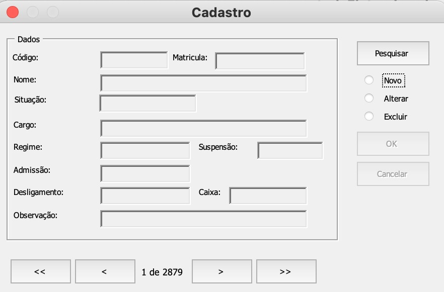

## Código VBA para Excel

Planilha em Excel para Gestão de Prontuários Eletronico. 

É possível alterar os metadados para adequar ao uso. Pode servir para gestão/controle de qualquer documentação. 

Compatibilidade a partir do Office 2007 - 2013

Em Breve:

Manual de Manutenção em Breve

Compatibilidade com Office mais atuais.
